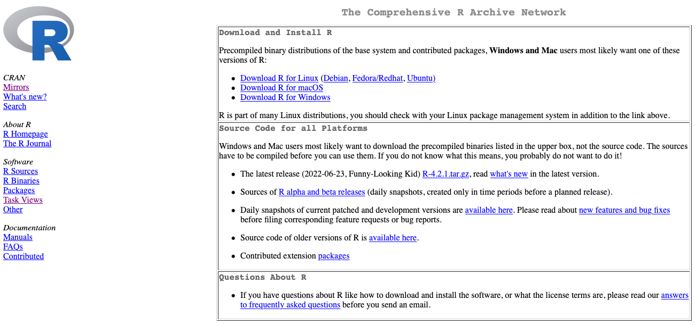

# Introduction

Welcome to the Exploratory Data Analysis of the [CRAN](https://cran.r-project.org) historical data set. As you may already know, CRAN is a network of servers around the world which store code and documentation for the R packages over time. As of writing this EDA, CRAN had just over 18,000 packages available in it's repository.

[{width="693"}](https://cran.r-project.org)

[Heads or Tails](https://www.kaggle.com/headsortails) has done a great job of grabbing historical data, cleaning it up and preparing it for us R enthusiasts. Read about the approach he followed in his [blogpost](https://heads0rtai1s.github.io/2022/07/22/kaggle-dataset-cran-packages/).

# Initial Setup {.tabset}

_Read through the initial setup in the 4 tabs below._

## Libraries {.tabset}

First, some I import some useful libraries and set some plotting defaults.

```{r libraries, message=FALSE, warning=FALSE}
# Data Manipulation
library(dplyr)
library(tidyr)
library(readr)
library(skimr)

# Plots
library(ggplot2)
library(naniar)
library(packcircles)
library(ggridges)

# Settings
theme_set(theme_minimal(
  base_size = 14
))
```


## Read In {.tabset}

Let's start be reading in the data. There are two `CSV` files in this dataset. From his [dataset page](https://www.kaggle.com/datasets/headsortails/r-package-history-on-cran):

-   `cran_package_overview.csv`: all R packages currently available through CRAN, with (usually) 1 row per package...
-   `cran_package_history.csv`: version history of virtually all packages in the previous table\...


```{r}
hist_dt <- read_csv(
  "../input/cran_package_history.csv",
  col_types = cols(
    package = col_character(),
    version = col_character(),
    date = col_date(format = "%Y-%m-%d"),
    repository = col_character()
  )
)
ov_dt <- read_csv(
  "../input/cran_package_overview.csv",
  col_types = cols(
    package = col_character(),
    version = col_character(),
    depends = col_character(),
    imports = col_character(),
    license = col_character(),
    needs_compilation = col_logical(),
    author = col_character(),
    bug_reports = col_character(),
    url = col_character(),
    date_published = col_date(format = "%Y-%m-%d"),
    description = col_character(),
    title = col_character()
  )
)
```

## Quick View {.tabset}

I love to take the first peek into a dataset with the amazing [`{skimr}`](https://docs.ropensci.org/skimr/index.html) package. We can see that we have the right data types set for all the columns, dates have been imported correctly. 

We can see in the `history` data that the 1st package reported on CRAN was in 22 years ago on _`r min(hist_dt$date)`!_  Furthermore, the `overview` tells us there's a package _{`r ov_dt$package[ov_dt$date_published == min(ov_dt$date_published, na.rm = T)][[1]]`}_ last published/updated on `r min(ov_dt$date_published, na.rm = TRUE)`.

While there's no missing data in the `history` dataset, there are a bunch of missing values in the `overview` dataset. Let's explore this a bit more.

```{r paged.print=FALSE}
skimr::skim(hist_dt)
skimr::skim(ov_dt)
```

## Data Quality {.tabset}

My favorite way of exploring missing data is to make it visible, using [Nick Tierney's](https://www.njtierney.com/about/) amazing [`{naniar}`](https://github.com/njtierney/naniar) package. There are a few columns with missing data. Let's look at these more closely.

* `depends` and `imports` have roughly a quarter of the data as `<NA>`. These are packages which _roughly_ have no external dependencies. The difference between the two can get a bit complex; best to learn about it in Hadley's chapter [here](https://r-pkgs.org/dependencies.html).
* Roughly half of `bug_reports` and `url` are missing. These don't seem to be data issues as much as authors who don't have a place to issue bugs or website for their package respectively.
* `date_published` has only 1 row with missing, which seems like a data quality spill.

```{r}
ov_dt |> 
  dplyr::arrange(date_published) |> 
  vis_miss()
```


# Interesting Questions

1. How long did packages take from their first release to version 1.0?
1. Which packages have had the most version updates?
1. What type of packages were most frequent in different years?
1. Who are the most productive authors?
1. Can you predict the growth toward 2025?
1. What license is most used? Has there been a change over time?
1. How many packages use all CAPS, all small, or a mixture?
1. How have the dependencies & imports changed over time?
1. Which repositories do packages use? Github/Bitbucket etc. How do these vary over time?
1. Do packages have URLs for bug reports?
1. Is there any temporal patterns to when versions are submitted to CRAN?
1. Have titles & descriptions gotten longer over time?
1. Do authors use minor versions?

# Feature Development {.tabset}

_Read through the feature development efforts in the tabs below._

## Version Numbers {.tabset}

```{r}
ov_dt <- ov_dt |>
  separate(
    version,
    into =
      c("major", "minor", "patch"),
    sep = "\\.",
    extra = "merge",
    fill = "right",
    remove = FALSE
  )
```

## Number of Dependencies & Imports {.tabset}

```{r}
ov_dt <- ov_dt |> 
  mutate(
    # Dependencies
    num_dep = purrr::map_int(
      .x = depends,
      .f = function(x){
        x |> 
          stringr::str_split(",", simplify = TRUE) |> 
          length()
      }
    ),
    num_dep = ifelse(is.na(depends), 0, num_dep),
    # Imports
    num_imports = purrr::map_int(
      .x = imports,
      .f = function(x){
        x |> 
          stringr::str_split(",", simplify = TRUE) |> 
          length()
      }
    ),
    num_imports = ifelse(is.na(imports), 0, num_imports)
  )
```

## Number of authors {.tabset}

```{r}
ov_dt <- ov_dt |> 
  mutate(
    num_authors = purrr::map_int(
      .x = author,
      .f = function(x){
        x |> 
          stringr::str_split(",", simplify = TRUE) |> 
          length()
      }
    )
  )
```

## Temporal Features {.tabset}

```{r}
ov_dt <- ov_dt |> 
  mutate(
    year = lubridate::year(date_published),
    month = lubridate::month(date_published, label = TRUE),
    day = lubridate::day(date_published),
    wday = lubridate::wday(date_published, label = TRUE),
    yr_mon = sprintf("%d-%s", year, month),
    dt = lubridate::ym(paste0(year, "-", month))
  )
```

## Length of Titles & Descriptions {.tabset}

```{r}
ov_dt <- ov_dt |>
  mutate(
    len_title = purrr::map_int(title, ~ stringr::str_count(.x, "\\w+")),
    len_desc = purrr::map_int(description, ~ stringr::str_count(.x, "\\w+"))
  )
```

## Package Licenses {.tabset}

```{r}
ov_dt <- ov_dt |> 
  mutate(
    license_cleaned = case_when(
      stringr::str_detect(license, "^GPL-3") ~ "GPL-3",
      stringr::str_detect(license, "^GPL\\s\\([\\s\\d\\.<=>]*3") ~ "GPL-3",
      stringr::str_detect(license, "^GPL-2") ~ "GPL-2",
      stringr::str_detect(license, "^GPL\\s\\([\\s\\d\\.<=>]*2") ~ "GPL-2",
      stringr::str_detect(license, "^AGPL") ~ "AGPL",
      stringr::str_detect(license, "^LGPL") ~ "LGPL",
      stringr::str_detect(license, "Apache") ~ "Apache",
      stringr::str_detect(license, "BSD") ~ "BSD",
      stringr::str_detect(license, "LGPL") ~ "LGPL",
      # stringr::str_detect(license, "GNU") ~ "GNU",
      stringr::str_detect(license, "MIT") ~ "MIT",
      stringr::str_detect(license, "CC0") ~ "CC0",
      # stringr::str_detect(license, "MPL") ~ "MPL",
      # stringr::str_detect(license, "Unlimited") ~ "Unlimited",
      # stringr::str_detect(license, "^CC") ~ "CC",
      license == "GPL" ~ "GPL",
      TRUE ~ "Other"
      )
  )
```

## Bug Reporting Domains {.tabset}

```{r}
ov_dt <- ov_dt |>
  mutate(domain = purrr::map_chr(bug_reports,
                                 ~ {
                                   if (is.na(.x))
                                     return("")
                                   else
                                     return(urltools::url_parse(.x)$domain)
                                 }))
```

# Graphical EDA

## Temporal Questions

```{r}
ov_dt |>
  group_by(dt) |>
  summarise_at(vars(num_dep, num_imports), list(mean = mean)) |>
  ggplot(aes(x = dt)) +
  geom_jitter(aes(y = num_dep_mean, color = "num_dep_mean"), alpha = 0.2) +
  geom_smooth(
    aes(y = num_dep_mean, color = "num_dep_mean"),
    span = 0.3,
    se = TRUE,
    alpha = 0.1,
    method = "loess"
  ) +
  geom_jitter(aes(y = num_imports_mean, color = "num_imports_mean"), alpha = 0.2) +
  geom_smooth(
    aes(y = num_imports_mean, color = "num_imports_mean"),
    span = 0.3,
    se = TRUE,
    alpha = 0.1,
    method = "loess"
  )
  # theme_light()
```

```{r fig.height=5, fig.width=5}
deps <- ov_dt |> 
  select(year, len_desc, len_title) |> 
  arrange(-year) |> 
  filter(!is.na(year), year > 2008) |> 
  mutate(year = factor(year, levels = seq(2008, 2022)))
deps |>
  pivot_longer(-year) |> 
  ggplot(aes(y = year, x = value, fill = name)) +
  stat_density_ridges(
    bandwidth = 4,
    jittered_points = F,
    position = position_points_jitter(height = 0),
                      point_shape = "|",
                      point_size = 2,
                      size = 0.25,
                      scale = .95,
                      quantile_lines = TRUE, 
                      quantiles = 2,
                      alpha = 0.7, 
                      rel_min_height = 0.01) +
  scale_x_continuous(limits = c(0,200), expand = c(0,0)) +
  coord_cartesian(clip = "off") +
  theme_ridges(center = TRUE)
```

-   Have titles & descriptions gotten longer over time?

```{r}
ov_dt |> 
    group_by(dt) |> 
    summarise_at(vars(len_title, len_desc), list(median = median, sd = sd), na.rm = TRUE) |> 
  ggplot(aes(x= dt)) +
    geom_jitter(aes(y = len_title_median, color = "len_title_median"), alpha = 0.2) +
  geom_smooth(aes(y = len_title_median, color = "len_title_median"), span = 0.3, se = FALSE) +
  geom_jitter(aes(y = len_desc_median, color = "len_desc_median"), alpha = 0.2) +
  geom_smooth(aes(y = len_desc_median, color = "len_desc_median"), span = 0.3, se = FALSE)
  # theme_light()
```

```{r}
ov_dt |> 
  filter(year %in% c(2022, 2020, 2018)) |> 
  ggplot() +
  geom_density(aes(x = len_desc, 
                   fill = as.factor(year), 
                   color = as.factor(year)
                   ),
               alpha = 0.3
               )
ov_dt |> 
  filter(year %in% c(2022, 2020, 2018)) |> 
  ggplot() +
  geom_histogram(aes(x = len_desc, 
                   fill = as.factor(year), 
                   color = as.factor(year)
                   ),
               alpha = 0.3
               ) +
  facet_wrap(~year)
```

```{r}
ov_dt |> 
  ggplot(aes(x= date_published, y = len_title)) +
  geom_jitter(alpha = 0.05) +
  geom_smooth(span = 0.1, se = FALSE) +
  theme_light() +
  scale_y_log10()

ov_dt |> 
  ggplot(aes(x= date_published, y = len_desc)) +
  geom_jitter(alpha = 0.05) +
  geom_smooth(span = 0.2, se = FALSE) +
  theme_light() +
  scale_y_log10()
```

```{r}

```

-   What license is most used? Has there been a change over time?

```{r}
ov_dt |> 
  group_by(license_cleaned) |> 
  count() |> 
  ggplot(aes(x = forcats::fct_reorder(license_cleaned, n), y = n, fill = license_cleaned)) +
  geom_col() +
  coord_flip() +
  theme_minimal() +
  guides(fill = FALSE) +
  labs(x = "", y = "")
```

```{r}
plot_bubbles <- function(dat,
                         .scale,
                         plot_radius,
                         bubble_radius,
                         alpha,
                         maxiter) {
  .qty <- nrow(dat)
  
  theta <- seq(0, 360, length.out = .qty + 1)
  
  dat$x <- plot_radius * cos(theta * pi / 180)[-1]
  dat$y <- plot_radius * sin(theta * pi / 180)[-1]
  dat$n_scaled <- dat$n / .scale
  
  xpack <- rep(dat$x, times = dat$n_scaled)
  ypack <- rep(dat$y, times = dat$n_scaled)
  
  coords <- tibble(
    x = xpack + runif(length(xpack)),
    y = ypack + runif(length(ypack)),
    r = bubble_radius
  )
  
  packed_coords <-
    circleRepelLayout(coords, sizetype = "r", maxiter = maxiter)
  
  packed_coords$layout |>
    ggplot(aes(x, y)) +
    geom_point(aes(size = radius), alpha = alpha) +
    coord_equal() +
    theme_minimal() +
    theme(
      legend.position = "none",
      panel.grid = element_blank(),
      axis.title = element_blank(),
      axis.text = element_blank()
    ) +
    geom_text(
      aes(
        x = x,
        y = y,
        label = label
      ),
      data = dat,
      hjust = "center",
      vjust = "center"
    )
}

ov_dt |> 
    count(license_cleaned) |> 
    top_n(6, n) |> 
  mutate(label = sprintf("%s\n%d Pkgs", license_cleaned, n)) |> 
    arrange(runif(1:n())) |> 
  plot_bubbles(
    .scale = 100,
    plot_radius = 10,
    bubble_radius = 0.56,
    alpha = 0.2,
    maxiter = 1000
  )


# .scale <- 100
# .qty <- 6
# lic <- ov_dt |> 
#   group_by(license_cleaned) |> 
#   count() |> 
#   arrange(-n) |> 
#   head(.qty) |>
#   mutate(n_scaled = round(n / .scale)) |> 
#   arrange(runif(1:n()))
#   
# r <- 10
# theta <- seq(0, 360, length.out = .qty+1)
# lic$x <- r * cos(theta * pi / 180)[-1]
# lic$y <- r * sin(theta * pi / 180)[-1]
# xpack <- rep(lic$x, times=lic$n_scaled)
# ypack <- rep(lic$y, times=lic$n_scaled)
# 
# coords <- tibble(x=xpack+runif(length(xpack)),
#                      y=ypack+runif(length(ypack)),
#                      r=.56)
# packed_coords <- circleRepelLayout(coords, sizetype="r", maxiter=1000)
# packed_coords$layout |> 
#   ggplot(aes(x, y)) +
#   geom_point(aes(size = radius), alpha = 0.2) +
#   coord_equal() +
#   theme_minimal() +
#   theme(legend.position = "none",
#         panel.grid = element_blank(),
#         axis.title = element_blank(),
#         axis.text = element_blank()) +
#   geom_text(aes(x = x, 
#                 y = y, 
#                 label = sprintf("%s\n%d Pkgs", license_cleaned, n)),
#             data = lic,
#             hjust = "center", 
#             vjust = "center") 

```

```{r}
ov_dt |> 
  group_by(dt) |> 
  count(license_cleaned) |> 
  mutate(license_cleaned = forcats::fct_reorder(license_cleaned, n)) |> 
  ggplot(aes(x= dt, y = n, color = license_cleaned)) +
  # geom_line( alpha = 0.3) +
  geom_jitter(alpha = 0.3) +
  geom_smooth(span = 0.3, se = FALSE) +
  theme_light()
```

-   Do packages have URLs for bug reports?

```{r}
ov_dt |> 
  group_by(dt) |> 
  count(url_exist = is.na(url)) |>  
  ggplot(aes(x= dt, y = n, color = url_exist)) +
  geom_jitter(alpha = 0.3) +
  geom_smooth(span = 0.3, se = FALSE) +
  theme_light()
ov_dt |> 
  group_by(dt) |> 
  count(url_exist = is.na(bug_reports)) |>  
  ggplot(aes(x= dt, y = n, color = url_exist)) +
  geom_jitter(alpha = 0.3) +
  geom_smooth(span = 0.3, se = FALSE) +
  theme_light()
```

-   Which repositories do packages use? Github/Bitbucket etc. How do these vary over time?

```{r}
ov_dt |> 
  filter(domain != "") |> 
  mutate(domain = forcats::fct_lump_min(domain, 20)) |> 
  group_by(dt) |> 
  count(domain) |>  
  ggplot(aes(x= dt, y = n, color = domain)) +
  geom_jitter(alpha = 0.3) +
  geom_smooth(span = 0.5, se = FALSE) +
  theme_light()
```

```{r}
ov_dt |> 
   filter(domain != "") |> 
  mutate(domain = forcats::fct_lump_min(domain, 20)) |> 
    count(domain) |> 
  mutate(label = sprintf("%s\n%d", domain, n)) |> 
    arrange(runif(1:n())) |> 
  plot_bubbles(
    .scale =50,
    plot_radius = 6,
    bubble_radius = 0.4,
    alpha = 0.2,
    maxiter = 1000
  )
```

-   Is there any temporal patterns to when versions are submitted to CRAN?

```{r}
ov_dt |> 
  filter(!is.na(dt), dt < "2022-07-01") |> 
  count(dt) |> 
  arrange(dt) |> 
  timetk::pad_by_time(dt, .by = "month", .pad_value = 0) |> 
  ggplot(aes(dt, n)) +
  geom_line()

ov_dt |> 
  filter(!is.na(dt), dt < "2022-07-01") |> 
  count(dt) |> 
  arrange(dt) |> 
  timetk::pad_by_time(dt, .by = "month", .pad_value = 0) -> xdat
timetk::plot_seasonal_diagnostics(xdat, dt, log(n), .interactive = FALSE)

timetk::plot_stl_diagnostics(xdat |> filter(dt > "2018-01-01", dt < "2022-07-01"), dt, n, .interactive = FALSE, .feature_set = c("observed", "season", "trend", "remainder"))
```
